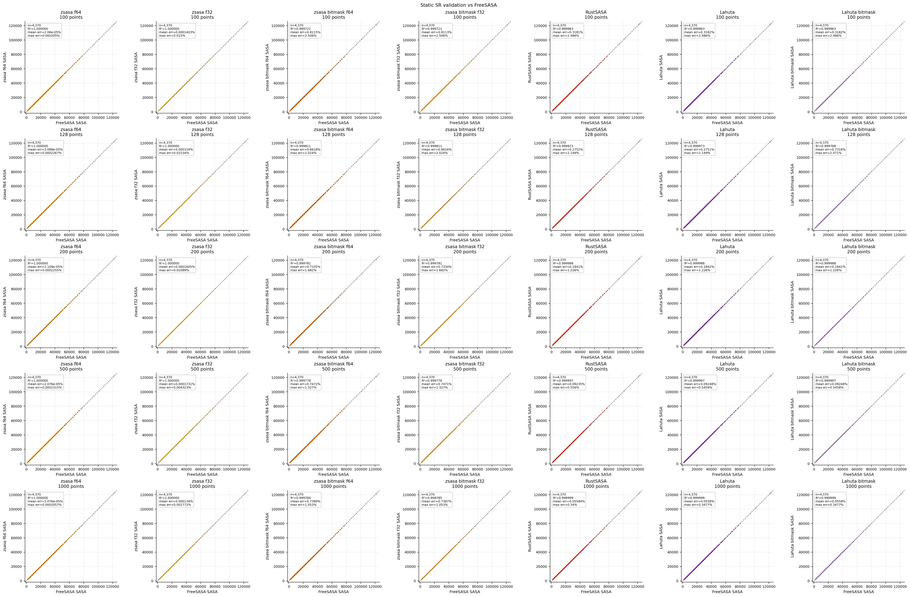
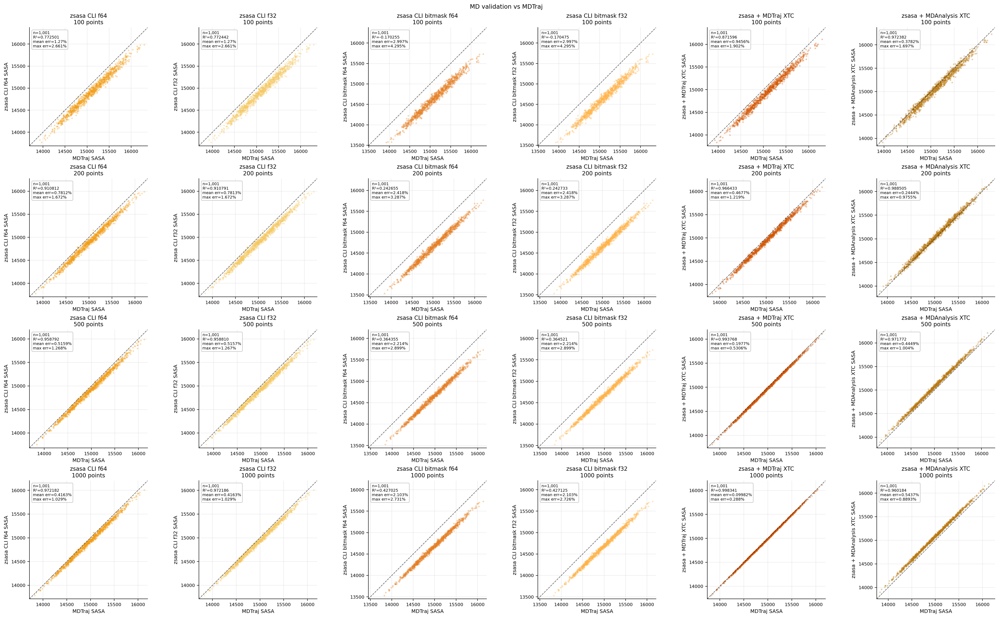
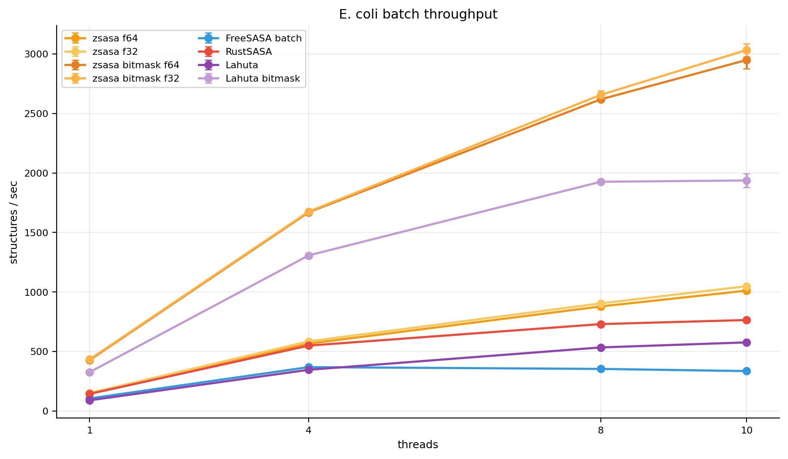
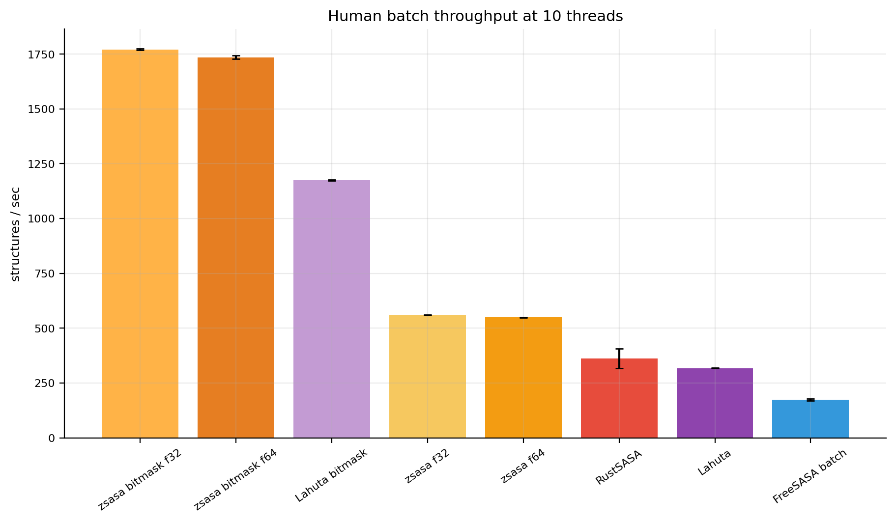
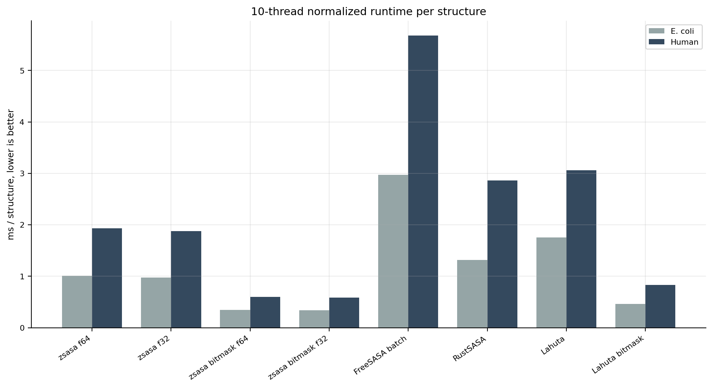
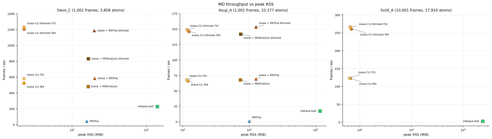
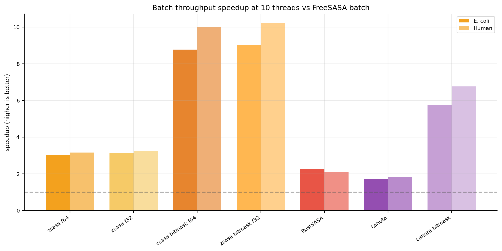
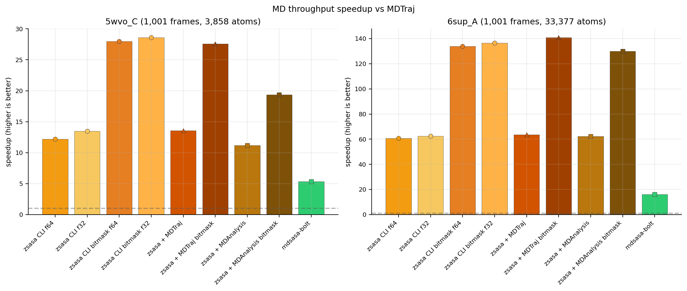

# Benchmark figure index

Exploratory figures generated from `results/benchmark.duckdb`.

## Sections

| section | png_figures |
| --- | --- |
| [Overview summaries](overview/index.md) | 3 |
| [Validation](validation/index.md) | 79 |
| [E. coli batch](batch_ecoli/index.md) | 11 |
| [Human batch](batch_human/index.md) | 6 |
| [Batch t10 comparison](batch_t10_comparison/index.md) | 3 |
| [MD / trajectory](md/index.md) | 9 |

## Database contents

| benchmark_kind | runs | datasets |
| --- | --- | --- |
| batch | 40 | 2 |
| trajectory | 25 | 3 |
| trajectory_validation | 28 | 1 |
| validation | 42 | 1 |

## Performance metrics in DB

| metric | rows | runs |
| --- | --- | --- |
| peak_rss | 520 | 65 |
| runtime | 520 | 65 |
| system_time | 65 | 65 |
| user_time | 65 | 65 |

## Quick winners

### Batch at 10 threads

| dataset | best_throughput | structures_per_sec | lowest_rss | rss_mib |
| --- | --- | --- | --- | --- |
| E. coli | zsasa bitmask f32 | 3032.9 | zsasa f32 | 42.8 |
| Human | zsasa bitmask f32 | 1771.3 | zsasa f32 | 76.6 |

### MD / trajectory

| dataset | best_throughput | frames_per_sec | lowest_rss | rss_mib |
| --- | --- | --- | --- | --- |
| 5wvo_C (1,001 frames, 3,858 atoms) | zsasa CLI bitmask f32 | 1230.5 | zsasa CLI f64 | 22.5 |
| 6sup_A (1,001 frames, 33,377 atoms) | zsasa + MDTraj bitmask | 153.6 | zsasa CLI f32 | 114.3 |
| 5vz0_A (10,001 frames, 17,910 atoms) | zsasa CLI bitmask f32 | 266.7 | zsasa CLI f32 | 62.7 |

## Representative figures

### Validation static scatter

### Validation MD scatter

### E. coli throughput

### Human t10 throughput

### Batch t10 size comparison

### MD throughput vs RSS

### Batch speedup overview

### MD speedup overview

