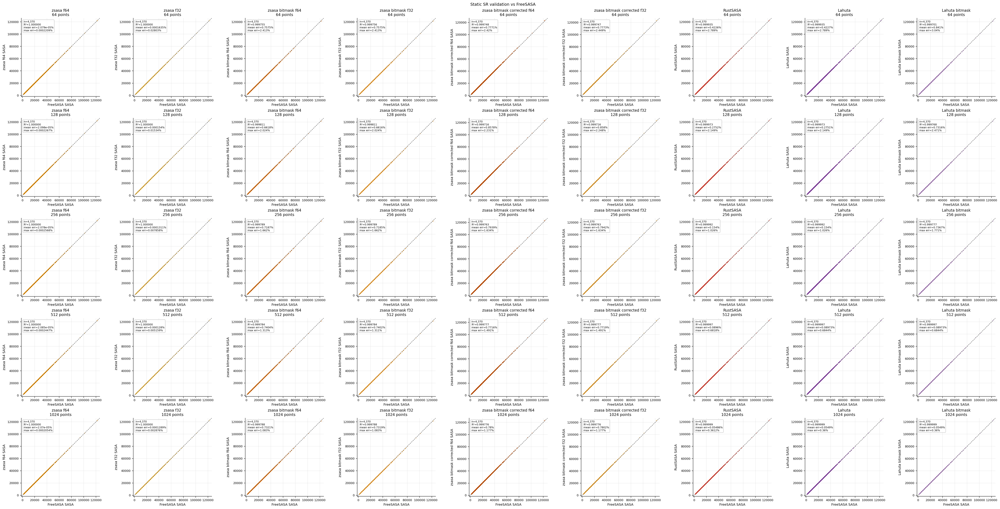
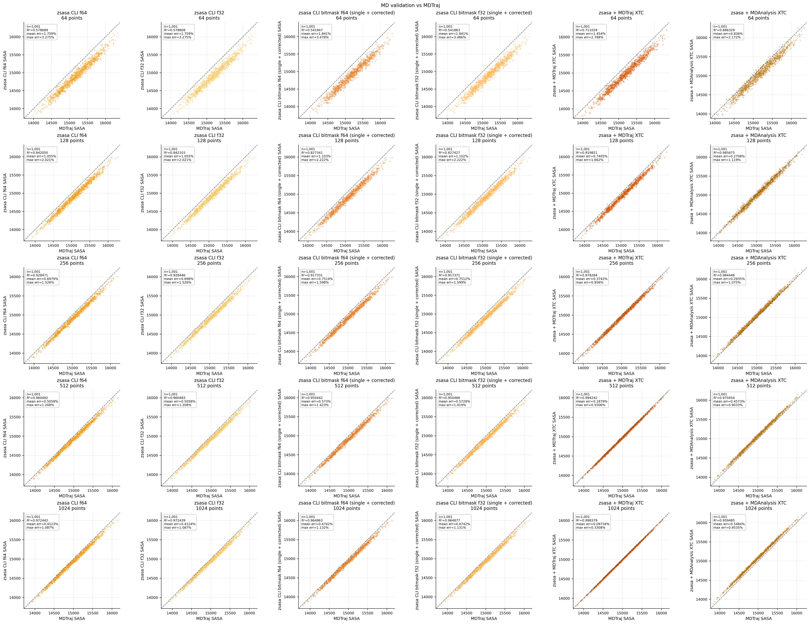
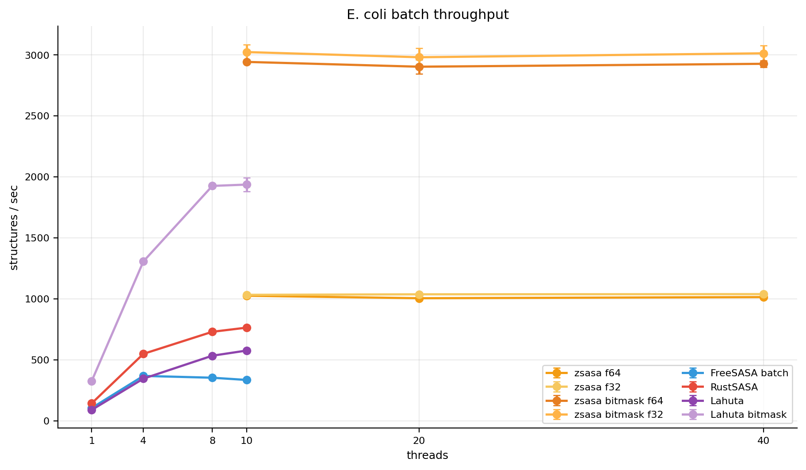
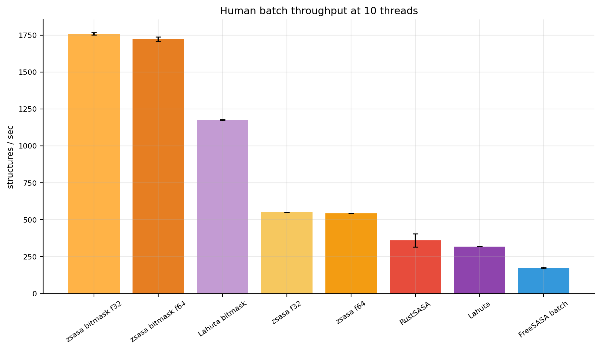
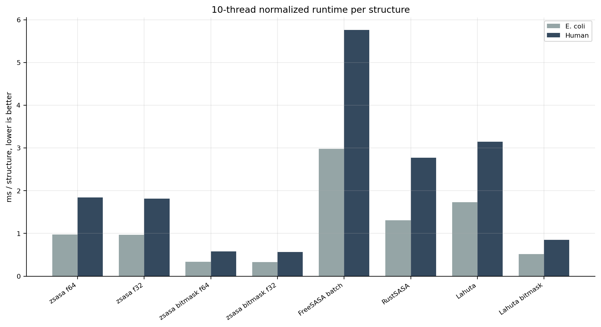
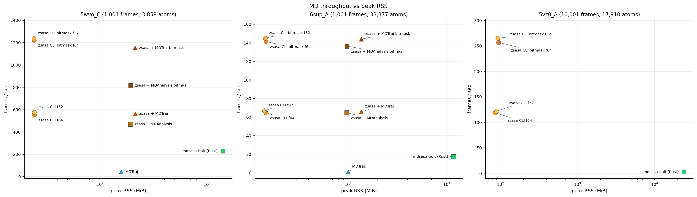
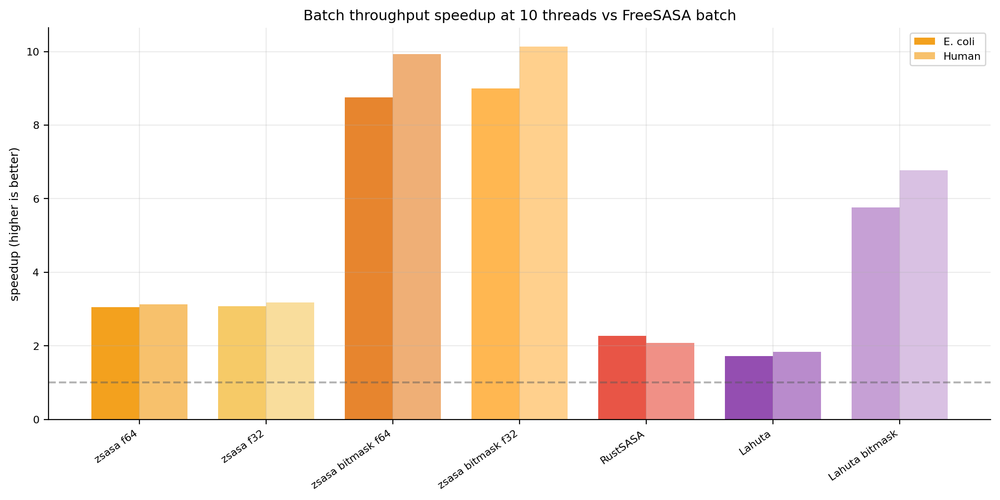
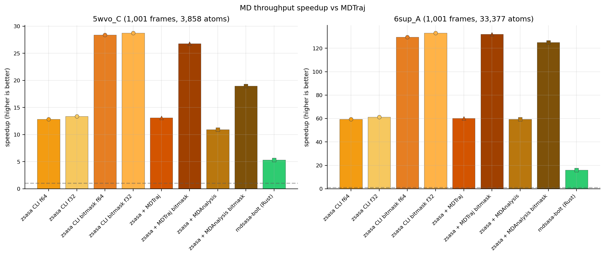

# Benchmark figure index

Exploratory figures generated from `results/benchmark.duckdb` in PNG/SVG/PDF formats.

[Open the filterable figure gallery](gallery.html).

[Open the draft STORY figure captions](story-captions.md).

## Sections

| section | png_figures |
| --- | --- |
| [Overview summaries](overview/index.md) | 3 |
| [Validation](validation/index.md) | 101 |
| [E. coli batch](batch_ecoli/index.md) | 15 |
| [Human batch](batch_human/index.md) | 8 |
| [Human mmCIF batch](batch_human_cif/index.md) | 8 |
| [Batch t10 comparison](batch_t10_comparison/index.md) | 3 |
| [MD / trajectory](md/index.md) | 13 |
| [single_file](single_file/index.md) | 10 |

## Database contents

| benchmark_kind | runs | datasets |
| --- | --- | --- |
| batch | 174 | 4 |
| single_file | 760 | 2 |
| trajectory | 166 | 3 |
| trajectory_validation | 103 | 1 |
| validation | 94 | 1 |

## Performance metrics in DB

| metric | rows | runs |
| --- | --- | --- |
| parse_time | 760 | 760 |
| peak_rss | 8766 | 1100 |
| runtime | 8749 | 1100 |
| sasa_time | 760 | 760 |
| system_time | 1100 | 1100 |
| total_time | 760 | 760 |
| user_time | 1100 | 1100 |

## Quick winners

### Batch at 10 threads

| dataset | best_throughput | structures_per_sec | lowest_rss | rss_mib |
| --- | --- | --- | --- | --- |
| E. coli | zsasa bitmask f32 | 3023.3 | zsasa f32 | 44.8 |
| Human | zsasa bitmask f32 | 1759.1 | zsasa f32 | 80.9 |

### MD / trajectory

| dataset | best_throughput | frames_per_sec | lowest_rss | rss_mib |
| --- | --- | --- | --- | --- |
| 5wvo_C (1,001 frames, 3,858 atoms) | zsasa CLI bitmask f32 | 1236.5 | zsasa CLI bitmask f32 | 24.2 |
| 6sup_A (1,001 frames, 33,377 atoms) | zsasa CLI bitmask f32 | 145.1 | zsasa CLI f32 | 142.8 |
| 5vz0_A (10,001 frames, 17,910 atoms) | zsasa CLI bitmask f32 | 265.2 | zsasa CLI f64 | 85.7 |

## Representative figures

### Validation static scatter

### Validation MD scatter

### E. coli throughput

### Human t10 throughput

### Batch t10 size comparison

### MD throughput vs RSS

### Batch speedup overview

### MD speedup overview

